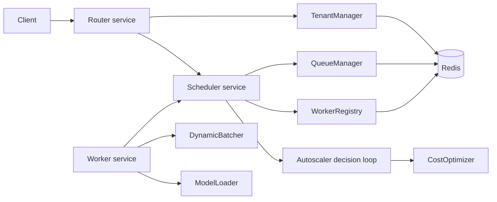
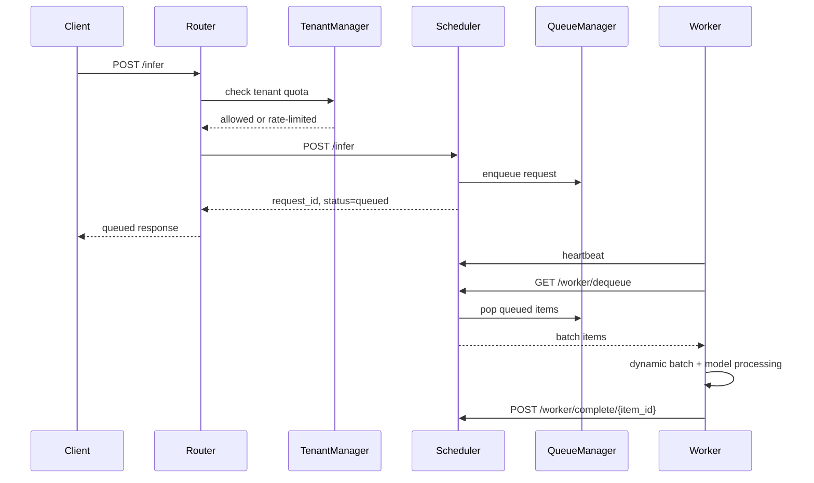

# Cost-Aware Autoscaling GPU Inference Cluster

This repository is a FastAPI-based inference serving prototype. It models a router, scheduler, and worker cluster where requests are rate-limited by tenant, queued in Redis, pulled by workers, batched, processed, and reported back to the scheduler. The project is best read as a tested prototype with deterministic simulation evidence and one local Docker Compose smoke/load benchmark, not as production performance evidence.

It is useful for reviewing service boundaries, queueing behavior, worker heartbeats, dynamic batching, and cost-aware autoscaling decision logic in a small system.

## What This Demonstrates

Supported by code, tests, or checked-in reports:

- FastAPI router, scheduler, and worker services.
- Redis-backed request queueing and worker heartbeat tracking.
- Tenant-aware rate limiting at the router.
- Priority-aware scheduler queue ordering.
- Worker-side dynamic batching and batch statistics.
- Cost-aware autoscaling decision logic based on queue depth, latency inputs, warm-pool settings, cooldowns, worker limits, and projected cost budget.
- Deterministic unit/integration tests using an in-memory Redis double.
- Deterministic autoscaling simulation reports.
- A local Docker Compose smoke/load benchmark for the router -> scheduler -> worker path.
- Docker Compose, Kubernetes, Prometheus, and Grafana configuration evidence.

## Architecture Overview



The router handles the public `/infer` entry point. It checks tenant limits and forwards accepted requests to the scheduler. The scheduler assigns request IDs, stores queue items, records worker heartbeats, exposes queue metrics, and runs the autoscaling decision loop. Workers send heartbeats, poll for queued items, batch them, run model inference through the model loader, and mark each item complete or failed.

The autoscaler currently makes and logs decisions. It does not create Kubernetes pods or Docker containers.

## Request Flow



Important behavior: the router response confirms enqueueing, not completed inference output. The checked-in local benchmark measures router enqueue-response latency.

## Repository Map

- `services/router/`: router API, tenant rate limiting, router metrics.
- `services/scheduler/`: queue manager, worker registry, autoscaling decision logic, cost accounting, scheduler API, scheduler metrics.
- `services/worker/`: worker loop, dynamic batching, model loading, worker metrics.
- `tests/unit/`: deterministic unit tests for batching, tenants, queues, registry, cost optimizer, and autoscaler behavior.
- `tests/integration/`: service-logic queue flow tests using an in-memory Redis double.
- `tests/benchmark/`: tests for simulation and benchmark report generation logic.
- `benchmarks/`: benchmark and simulation scripts.
- `benchmarks/results/`: checked-in latest simulation and local stack benchmark reports.
- `kubernetes/`: Kubernetes manifests as configuration evidence.
- `monitoring/`: Prometheus scrape/alert config and Grafana dashboard JSON.
- `version_analysis/`: older generated benchmark artifacts and plots with limited environment metadata.
- `docs/`: architecture, case-study, and repository guide documentation.
- `PROJECT_EVIDENCE.md`: claim-by-claim evidence ledger for CV-safe wording.

For a file-by-file reading path, see [`docs/repository-guide.md`](docs/repository-guide.md).

## Evidence And Evaluation

### Deterministic Tests

Run the focused tests that do not require Docker, Redis, Kubernetes, or GPU:

```bash
python -m pytest -p no:cacheprovider \
  tests/unit/test_batching.py \
  tests/unit/test_cost_optimizer.py \
  tests/unit/test_autoscaler.py \
  tests/unit/test_tenant_isolation.py \
  tests/unit/test_priority_queue.py \
  tests/unit/test_worker_registry.py \
  tests/integration/test_scheduler_queue.py \
  tests/benchmark/test_autoscaling_simulation.py \
  tests/benchmark/test_local_stack_benchmark.py
```

These tests use an in-memory Redis double where needed. They are evidence for deterministic service logic, not for production reliability.

### Autoscaling Simulation

Run:

```bash
python benchmarks/autoscaling_simulation.py
```

Checked-in reports:

- [`benchmarks/results/autoscaling_simulation_latest.json`](benchmarks/results/autoscaling_simulation_latest.json)
- [`benchmarks/results/autoscaling_simulation_latest.md`](benchmarks/results/autoscaling_simulation_latest.md)

Current checked-in aggregate summary:

| Metric | Value |
|---|---:|
| Scenarios | 9 |
| Steps | 27 |
| Scale-up decisions | 7 |
| Scale-down decisions | 3 |
| Cooldown blocks | 2 |
| Cost-budget blocks | 2 |
| Max-worker blocks | 2 |
| Warm-pool floor blocks | 8 |
| Simulated estimated GPU cost | $5.041666 |
| Simulated projected avoided cost | $0.208333 |

These numbers are simulated and projected. They are not real GPU usage or cloud billing results.

### Local Stack Smoke/Load Benchmark

With Docker Compose already running, run:

```bash
python benchmarks/local_stack_benchmark.py --requests 30 --concurrency 3 --settle-seconds 2
```

Checked-in reports:

- [`benchmarks/results/local_stack_benchmark_latest.json`](benchmarks/results/local_stack_benchmark_latest.json)
- [`benchmarks/results/local_stack_benchmark_latest.md`](benchmarks/results/local_stack_benchmark_latest.md)

Current checked-in local result:

| Metric | Value |
|---|---:|
| Benchmark status | completed |
| Requests attempted | 30 |
| Successful requests | 30 |
| Failed requests | 0 |
| Status counts | `{'200': 30}` |
| Throughput | 3.4303 requests/second |
| Router enqueue-response p50 | 663.7707 ms |
| Router enqueue-response p95 | 2389.2557 ms |
| Router enqueue-response p99 | 2390.5513 ms |
| Scheduler queue depth after run | 0 |
| Scheduler completed count after run | 30 |
| Scheduler active workers after run | 2 |

This is local smoke/load evidence only. It measures router `/infer` enqueue-response latency, not completed inference latency. Worker host metrics were unavailable in the checked-in run because Docker Compose did not publish worker port 8002 to the host.

## How To Run Locally

Install development dependencies:

```bash
pip install -r requirements-dev.txt
```

Start the local stack:

```bash
docker-compose up --build
```

Send a sample request:

```bash
curl -X POST http://localhost:8000/infer \
  -H "Content-Type: application/json" \
  -H "X-Tenant-Id: demo" \
  -d '{"text":"hello from the inference cluster","priority":1}'
```

Useful endpoints when the stack is running:

- Router health: `http://localhost:8000/health`
- Router JSON metrics: `http://localhost:8000/metrics`
- Router Prometheus metrics: `http://localhost:8000/metrics/prometheus`
- Scheduler health: `http://localhost:8001/health`
- Scheduler JSON metrics: `http://localhost:8001/metrics`
- Scheduler Prometheus metrics: `http://localhost:8001/metrics/prometheus`
- Worker health/metrics: available inside the Compose network at `http://worker:8002`; host access requires publishing port 8002.

## Limitations And Unsupported Claims

Do not use this repository to claim:

- Production deployment, production traffic, or real users.
- Real GPU cost savings.
- Live Kubernetes autoscaling validation.
- Verified live-GPU QPS, p95, or p99 latency.
- SLA, uptime, or production reliability.
- GPU utilization improvement. No GPU utilization metric is emitted.
- Model quality, accuracy, F1, precision, or recall.
- Exactly-once queueing or production-grade fault tolerance.

## Future Work

These are next steps, not current functionality:

- Add a live Redis-backed integration test that runs outside the in-memory Redis double.
- Publish or proxy worker metrics in the local stack so worker batch stats are easier to collect from the host.
- Add a small completed-inference endpoint or callback flow if the project should measure end-to-end inference latency.
- Validate Kubernetes behavior in a real cluster before claiming Kubernetes autoscaling.
- Add a documented GPU benchmark only if the environment, device metrics, and model setup are recorded.
- Add dashboard screenshots or a Prometheus scrape check if monitoring evidence needs to be reviewer-friendly.

## Deeper Docs

- [`docs/architecture.md`](docs/architecture.md): components, data flow, storage, metrics, and deployment shape.
- [`docs/repository-guide.md`](docs/repository-guide.md): where to read the code and what each important file does.
- [`docs/case-study.md`](docs/case-study.md): project story, design choices, evidence, limitations, and future work.
- [`PROJECT_EVIDENCE.md`](PROJECT_EVIDENCE.md): claim-by-claim evidence ledger for safe CV wording.
