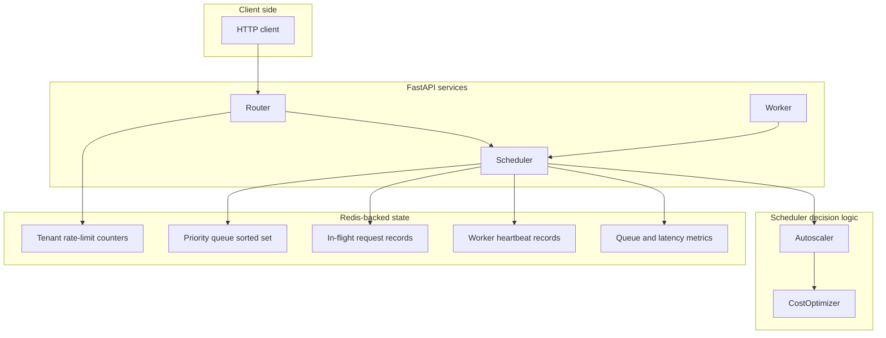
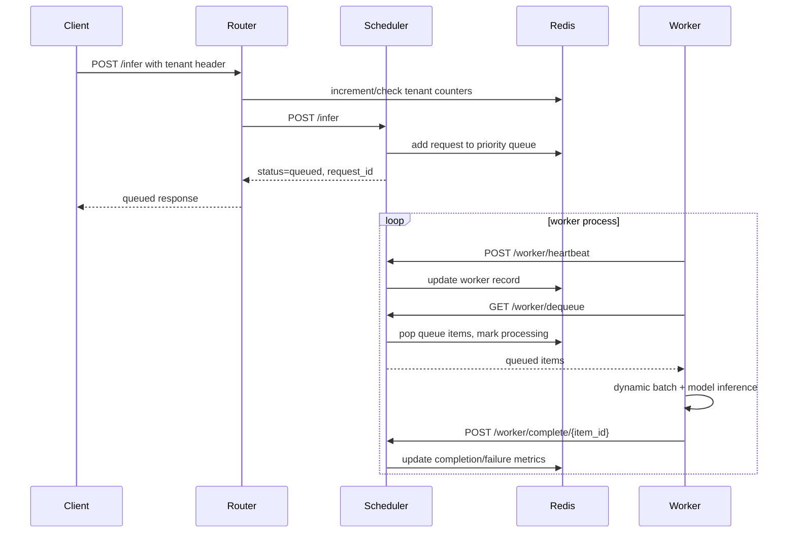
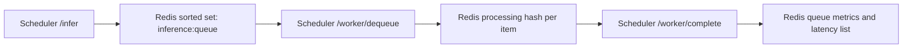
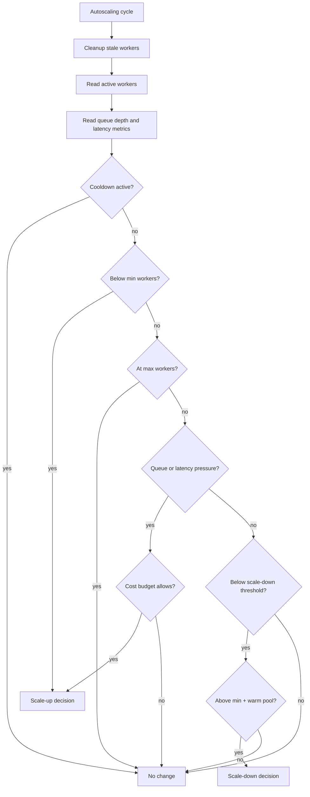

# Architecture Guide

This document explains how the inference cluster prototype is put together. It describes current repository behavior only.

## System Shape

The services are split by responsibility:

- Router: accepts tenant-scoped requests, applies rate limits, and forwards accepted work.
- Scheduler: owns queue state, worker state, completion accounting, metrics, and autoscaling decisions.
- Worker: sends heartbeats, pulls queue items, batches work, runs model inference, and reports completion.

Redis is the shared state layer for tenant counters, queued work, in-flight work, queue metrics, and worker registry data.

## Request And Worker Flow

The router returns after the scheduler accepts and queues a request. The worker completion path is asynchronous from the caller's point of view.

## Components

### Router

Files:

- `services/router/main.py`
- `services/router/tenant_manager.py`
- `services/router/config.py`

The router exposes `/infer`, `/health`, `/tenant/metrics`, `/metrics`, and `/metrics/prometheus`. Its main job is admission control. It checks tenant quotas before forwarding a request to the scheduler. The router's `/metrics` endpoint also tries to include scheduler metrics for convenience.

### Scheduler

Files:

- `services/scheduler/main.py`
- `services/scheduler/queue_manager.py`
- `services/scheduler/worker_registry.py`
- `services/scheduler/autoscaler.py`
- `services/scheduler/cost_optimizer.py`
- `services/scheduler/config.py`

The scheduler is the coordination point. It accepts requests from the router, stores queue items, responds to worker polling, records completion/failure state, exposes metrics, and runs the autoscaling decision loop.

The autoscaler evaluates current queue depth, p95/p99 latency inputs from queue metrics, worker count, cooldown state, warm-pool rules, max-worker rules, and cost-budget checks. Its current scale-up behavior logs the target worker count. It does not create new Docker containers or Kubernetes pods.

### Worker

Files:

- `services/worker/main.py`
- `services/worker/batch_processor.py`
- `services/worker/model_loader.py`
- `services/worker/config.py`

The worker starts a model loader, optionally warms the model, sends heartbeats to the scheduler, polls for queued work, batches items through `DynamicBatcher`, and reports each item as complete or failed. It also exposes local health and metrics endpoints.

## Queueing And State

Important queue behaviors:

- Priority affects the Redis sorted-set score.
- Same-priority behavior is timestamp-based tie-breaking.
- Dequeued items move into per-item processing records.
- Completion updates success/failure counters and latency samples.

The tests cover queue ordering, metadata preservation, metrics updates, sequential completion, and failure accounting using an in-memory Redis double.

## Autoscaling Decision Flow

The deterministic simulation in `benchmarks/autoscaling_simulation.py` feeds controlled scenarios into this decision logic. It is simulation evidence only.

## Metrics And Monitoring

The services emit or expose these current Prometheus metrics:

- Router: `router_requests_total`, `router_request_duration_seconds`
- Scheduler: `scheduler_requests_total`, `scheduler_queue_depth`, `scheduler_active_workers`, `scheduler_cost_current_hour`, `scheduler_latency_p50_ms`, `scheduler_latency_p95_ms`, `scheduler_latency_p99_ms`
- Worker: `worker_requests_processed`, `worker_batch_size`, `worker_batch_queue_size`

Monitoring configuration lives under `monitoring/`. The repository does not include a live Prometheus scrape proof or Grafana screenshot.

## Deployment Shape

Docker Compose defines Redis, Prometheus, Grafana, router, scheduler, and worker services. The worker has an internal healthcheck on port 8002, but the checked-in Compose file does not publish that worker port to the host.

Kubernetes manifests exist under `kubernetes/`. They are configuration evidence, not validation of live Kubernetes autoscaling.

## Evidence Boundaries

Current evidence supports a tested prototype, deterministic autoscaling simulation, and local Docker Compose smoke/load benchmark. It does not support production performance, real GPU cost savings, live Kubernetes autoscaling validation, live-GPU p95/p99/QPS, SLA, uptime, or model accuracy claims.
